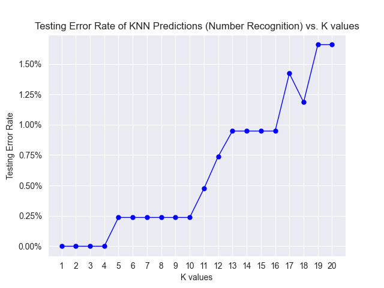
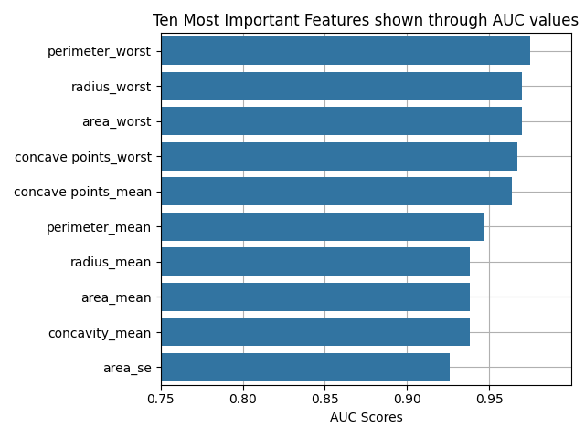
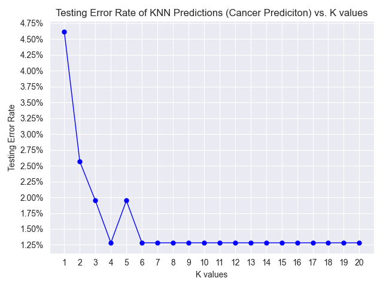

# **CSCI444:Machine Learning Assignment #1** 
Owen Shay
202006664

x2020gft@stfx.ca

October 15th, 2023

## Dataset and setting up the data 
> The dataset is an assortment of handwritten numbers, from 0-9, stored in a 3D array of size (28, 28, 750) for training data, meaning 750 images of size 28x28px, and (28, 28, 250) for testing data, meaning 250 28x28px images. In this assignment we only used the eights and nines.

>The data was formatted in a .mat file, and accessed through the 'loadmat' function, then the eights and nines were stored in arrays within a dictionary and hand-labeled:

    matFile = loadmat("NumberRecognitionAssignment1.mat")

    eightsNinesTraining = {
        "imageArrayTraining8": np.array(list(matFile["imageArrayTraining8"])),
        "imageArrayTraining9": np.array(list(matFile["imageArrayTraining9"])),
        "labels": [0] * len(matFile["imageArrayTraining8"][0][0])
        + [1] * len(matFile["imageArrayTraining9"][0][0]),
    }

    eightsNinesTesting = {
        "imageArrayTesting8": np.array(list(matFile["imageArrayTesting8"])),
        "imageArrayTesting9": np.array(list(matFile["imageArrayTesting9"])),
    }

    testLabels = {
    "labels": [0] * len(matFile["imageArrayTesting8"][0][0])
    + [1] * len(matFile["imageArrayTesting9"][0][0])
    }

> And were transposed and reshaped, then vertically stacked to fit the KNN's dimensional requirements:

    eightsTrain = (
        eightsNinesTraining["imageArrayTraining8"].transpose(2, 0, 1).reshape(750, 784)
    )

    ninesTrain = (
        eightsNinesTraining["imageArrayTraining9"].transpose(2, 0, 1).reshape(750, 784)
    )

    eightsTest = (
        eightsNinesTesting["imageArrayTesting8"].transpose(2, 0, 1).reshape(250, 784)
    )

    ninesTest = (
        eightsNinesTesting["imageArrayTesting9"].transpose(2, 0, 1).reshape(250, 784)
    )

    eightsNinesTrain = np.vstack((eightsTrain, ninesTrain))
    eightsNinesTest = np.vstack((eightsTest, ninesTest))
    trainTest = np.vstack((eightsNinesTrain, eightsNinesTest))

>Training and testing splits were obtained from combining and splitting the training and testing sets into 80% training images and 20% testing images, then shuffling the samples around using sklearn:

    x_train, x_test, y_train, y_test = sklearn.model_selection.train_test_split(
        trainTest,
        eightsNinesTraining["labels"] + testLabels["labels"],
        random_state=40, 
        shuffle=True,
        test_size=0.2,
    )  

> And an array is initialized to hold all calculated error rates:

    errorRate = [] 

> These splits were ran through the KNN model at K values of 1-20:

    for i in range(1, 21):
        knn = KNeighborsClassifier(i)
        knn.fit(x_train, y_train)
        prediction = knn.predict(x_test)

> AUC and error rates are also calculated within this same 'for' loop for each K value:

    auc = roc_auc_score(y_true=y_test, y_score=prediction)
    errorRate.append((1 - auc) * 100)

> And here is the resultant plot of the testing error rates vs. the K values:

# **Question #1**
### a) Why does testing error rise at high values of K?

>Testing error rises at higher values of K as the tests become more subject to noise within the set as they pick up neighbors that are much futher away in some cases. For example, at K=20 it is possible that their nearest 20 neighbors contain a majority of the wrong class and would skew results. It is also effected by high K values because the decision boundary is more loosely fit, sometimes leading to over-generalized predictions as the boundary is over-smoothed which usually leads to decreased accuracy in predictions on different data.

### b) What is the error rate at the lowest K? Do you expect this to be a reliable performance estimate? Why?

> The error rate at K=1 was much lower than expected, sitting at  0.0%. Even though this means that it is 100% accurate in prediction, I would expect that this would not be a reliable estimate as I think that it is a product of being too closely tailored to the training data and would be highly sensitive to outliers in a new testing set, making for a not-so robust model.

# **Question #2**

## **Dataset Description**
>The dataset I've chosen to use is on breast cancer, formally named the [Breast Cancer Wisconsin (Diagnostic) Dataset](https://www.kaggle.com/datasets/yasserh/breast-cancer-dataset/data). This dataset contains 569 samples with 32 measurements each. Ten of these measurements are unique, and the others are products of further data analysis (ex. radius mean, radius standard error and "worst" radius (worst is the mean of the three largest values present in the sample) are all calculated). 

>These ten features are computed for each cell nucleus: 
1. <u>Radius</u> of distances from center to points on the perimeter. 
2. <u>Texture</u> which is the standard deviation of grey-scale values obtained from x-ray. 
3. <u>Outer Perimeter </u> which is the size of the core tumor.
4. <u>Area</u> of the lobes.
5. <u>Smoothness</u> which is the local variation in radius lengths. 
6. <u>Compactness</u> in lobe structure (calculated using perimeter^2 / area - 1.0). 
7. <u>Concavity</u> which is the severity of concave portions of the contour. 
8. <u>Number of Concave Points</u> which is the number of concave portions of the contour. contour in benign mass is round and oval, and the contour in a malignant mass is irregular and spiculated. 
9. <u>Symmetry</u> of lobe structure. 
10. <u>Fractal Dimension</u> which is a quantification of the complex geometry present within the breast masses at various scales/zoom sizes (calculated using the "coastline approximation" - 1, which is an approximation technique used to represent intricate features of coastlines (or in this case breast cells) in a simplified way).

>The rest are products of these ten, 3 for each measure (mean, standard error and worst) totalling up to 30 measurements, an ID value and a label for each sample.

>The nature of the groups of interest/not of interest is whether or not the tumor present in the breast is malignant (cancerous); denoted as 'M'; or benign (non-cancerous), denoted as 'B'. There are many different combinations of features that all work together in classifying if a tumor is malignant or benign, for example malignant tumors usually have a abnormally high radius and outer perimeter mean values, while benign tumors usually have lower values across the board. 

>Sample counts for the malignant tumors is 212 samples, making up 37% of all samples. The count of benign tumors is 357 samples, making up 63% of all samples. 

> Here is how I have preprocessed the data:

    df = pandas.read_csv("breast-cancer.csv.xls")
    df = df.drop(["id"], axis=1) 
    df["diagnosis"] = df["diagnosis"].replace({"M": 1, "B": 0})

    testingData = df.drop(["diagnosis"], axis=1)
    labels = df["diagnosis"]

> I have normalized this data into a range between 0-1 using sklearns MinMaxScaler function:

    for i in testingData:
        testingData[i] = MinMaxScaler().fit_transform(testingData[i].values.reshape(-1, 1))

## **AUC Values and Analysis**
>Here are the top ten results after analyzing each measurement individually and calculating their AUC scores:

|        Feature        |  AUC  |
|:----------------------|:-----:|
| Worst Perimeter            | 0.975 |
| Worst Radius            | 0.970 |
| Worst Area                | 0.970   |
| Worst Concave Points                  | 0.967   |
| Mean Concave Points                 | 0.964   |
| Mean Perimeter                   | 0.947   |
| Mean Radius                  | 0.938   |
| Mean Area                  | 0.938   |
| Mean Concavity                  | 0.938   |
| Area Standard Error            | 0.926 |

> And visualized through this plot, showing the importance of each feature through their respective AUC scores:

> These AUC scores show which measurements have the most potential to inform prediction within the model. This shows that the Worst Perimeter; or the mean of the largest 3 breast mass perimeter values found in a sample; is the top feature for predicting if a tumor is malignant in this dataset. All of these ten feature's AUC values are very close and all show great potential to inform the predictions as well.

# **Question #3**
> Since my dataset was not split into training and testing sets, I manually made the splits that I used for my KNN tests with sklearn's train_test_split function:

    x_train, x_test, y_train, y_test = sklearn.model_selection.train_test_split(
        testingData, labels, random_state=40, shuffle=True, test_size=0.2
    ) 

> And an array is initialized to hold all calculated error rates:

    errorRate = [] 

> KNN is then trained and then predicts the testing data for K values of 1-20:

    for i in range(1, 21):
        knn = KNeighborsClassifier(i)
        knn.fit(x_train, y_train)
        prediction = knn.predict(x_test)

>Where i is the inputted value of K, the amount of nearest neighbors checked.

> AUC and error rates are also calculated within this same 'for' loop for each K value:

    auc = roc_auc_score(y_true=y_test, y_score=prediction)
    errorRate.append((1 - auc) * 100)

> And here is the resultant plot of the testing error rates vs. the K values:

> This shows K values of 4 and 6-20 have the best performance with this dataset. K=1 has by far the worst performance; most likely from overfitting to the training data; making it very sensitive to outliers and will not generalize well in testing. Error rates decline as K goes towards 4, with a small spike at 5. I found it very interesting that the model felt no issues as K rose, tying with the lowest error rate up to K=20.

> The profile of this plot differs significantly from the plot in question one. In this case, it exhibits a sort-of reverse logarithmic pattern, with the error rate peaking at K=1 and flattening out as K grew higher. In contrast, the plot in question one follows a linear pattern, error rate growing as K rises, with K=1 having the lowest error rate and K=20 haivng the highest.

> In addition, the error rates in this plot are a bit higher compared to those in question one, with the lowest error rate for this plot being almost the same as the highest in question 1. This is likely due to the increased complexity of the problem, stemming from the higher number of dimensions involved. The dataset used here contains 30-dimensional data as input for the KNN algorithm, whereas the number recognition dataset used only 3-dimensional data flattened into 2-dimensions. KNN is known to be less effective in high-dimensional spaces because data points tend to be more distant from each other, leading to less relevant neighbors.

# **Bonus Analysis**

### <u>Only using the top ten features for KNN calculations</u>

> For question 3, I used every feature in the dataset. I was wondering if I could improve my predictions; or at least get comparable results; by only using the ten most important features for classification, found through the AUC calculations done in question 2. This would make my model more lightweight and reduce dimensions in my problem, in theory helping the model.

> Here are my results:

 vs. K values")

> This figure shows that this model underperforms compared to the previous, with the lowest error rates being only marginally better than the previous models highest. This suggests that there are more signifigant relationships in the data that contain the other features that this model fails to capture. 

> If I were to implement this model in a serious diagnostic setting, I would choose to use every feature as the results are much more accurate. 

### <u>Accuracy, Precision, Recall, F1</u>

> I was curious as to what the accuracy, precision, recall, F1 scores and confusion matricies would look like for these tests, so I wanted to calculate them. Here are my findings for the breast cancer dataset and when only using the top ten features:

    BREAST CANCER PREDICTIONS 
    Values all for 7 neighbor KNN model: 
    ------------------------------------------ 
    Accuracy:  0.991 
    Recall:  0.974 
    Precision:  1.0 
    F1 Score:  0.987 
    Confusion Matrix: 
    [[75  0]
    [ 1 38]] 
    ------------------------------------------

    BREAST CANCER PREDICTIONS (Top Ten Features). 
    Values all for 3 neighbor KNN model: 
    ------------------------------------------ 
    Accuracy:  0.965 
    Recall:  0.949 
    Precision:  0.949 
    F1 Score:  0.949 
    Confusion Matrix: 
    [[73  2]
    [ 2 37]] 
    ------------------------------------------

> As well as for the number recognition dataset:
 
    NUMBER RECOGNITION 
    Values all for 5 neighbor KNN model: 
    ------------------------------------------ 
    Accuracy:  0.998 
    Recall:  1.0 
    Precision:  0.995 
    F1 Score:  0.997 
    Confusion Matrix: 
    [[210   1]
    [  0 189]] 
    ------------------------------------------

> Each of these statistics are great for checking the proficiency of your machine learning model in different use cases and categories. 

> For example, it would be best for the number recognition model to have a high accuracy, as we only really care about how often it makes the correct prediction as the stakes are not very high in this case. 

> However, for predicting the correct diagnosis of a sample tumor; something that could in theory mean life or death or at the very least an unneeded surgery; having a high F1 score is very important. Having a high F1 score would be important in this case as it is the harmonic mean of recall (useful when the cost of false negatives is high), and precision (useful when the cost of false positives is high). In cancer diagnosis, having false positives and/or false negatives could imply serious consequences to the patient's well-being.

